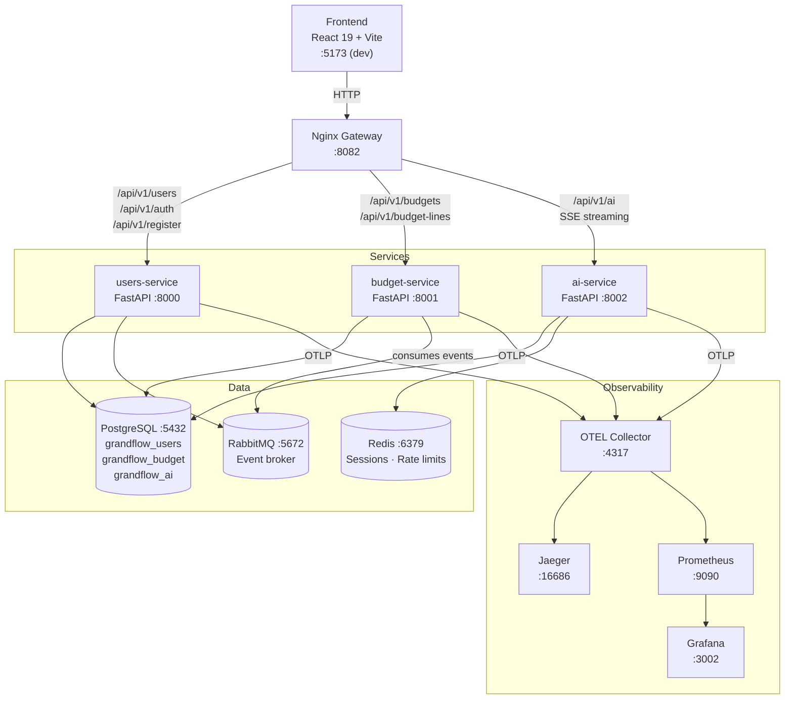

# GrantFlow

GrantFlow is an open-source platform for budget management and financial reporting in NGOs and donor organizations. It was born from 20 years of watching organizations manage grant budgets in incompatible Excel files — and a belief that modern software engineering can fix that.

> **Status:** Active development — not yet production-ready.

→ **[Product Overview](docs/PRODUCT.md)** — what GrantFlow does, who it's for, and why it exists.

---

## Architecture



**Communication patterns:**
- Frontend → Services: via Nginx (single entry point at `:8082`)
- budget-service → users-service: direct HTTP (service discovery via env var)
- users-service → budget-service: RabbitMQ events (user created/updated)
- ai-service streams responses via Server-Sent Events (SSE)

---

## Tech Stack

| Layer | Technology |
|---|---|
| Backend | Python 3.11+ · FastAPI 0.116 · Pydantic v2 |
| Frontend | React 19 · TypeScript 5.8 · Vite · TailwindCSS · TanStack Query |
| ORM | SQLAlchemy 2.0 (async) · Alembic migrations |
| Database | PostgreSQL 15 (one DB per service) |
| Cache | Redis 7 |
| Messaging | RabbitMQ 3 (aio-pika) |
| Auth | JWT (HS256) · refresh token rotation via Redis |
| AI | OpenAI API · Ollama (local dev) · HuggingFace Transformers |
| Observability | OpenTelemetry (OTLP) · Jaeger · Prometheus · Grafana |
| Gateway | Nginx |
| Containerization | Docker · Docker Compose |
| CI | GitHub Actions (lint + tests per service) |

---

## Services

### users-service `:8000`
User and customer management, JWT authentication, role-based access control. Publishes `user.created` / `user.updated` events to RabbitMQ. Customers are modelled with `is_ngo` and `is_donor` boolean flags to support both sides of a grant relationship.

### budget-service `:8001`
Budget and budget-line CRUD. Consumes user events from RabbitMQ to maintain a local read model. Key endpoints:
- `POST /api/v1/budgets/with-lines` — atomic create: budget + all lines in one transaction
- `POST /api/v1/budgets/ai/stream` — proxies the AI service and auto-creates a budget from the parsed output
- Donor template mapping: detects and maps Excel donor budget formats to a normalized schema

### ai-service `:8002`
LLM-powered budget parsing. Accepts free-text or uploaded documents and streams structured budget JSON via SSE. Features:
- Provider abstraction: Ollama (dev) → OpenAI (prod), switchable via env var
- Per-customer rate limiting via Redis (default: 100 req/hour)
- Full audit log of every AI request (model, tokens, duration, success/failure)
- Prompt versioning: system and user prompts stored in DB, swappable without deploys

---

## Key Design Decisions

| Decision | Rationale |
|---|---|
| One PostgreSQL DB per service | Enforces service boundaries; avoids shared-schema coupling |
| Shared Python library (`/shared`) | Common JWT logic, Pydantic schemas, and OpenTelemetry setup without duplication |
| RabbitMQ over direct HTTP for user events | Decouples budget-service from users-service availability |
| OpenTelemetry (OTLP) over Sentry | Vendor-agnostic; same instrumentation works with Jaeger today, any backend tomorrow |
| FastAPI async-first | All I/O (DB, Redis, HTTP, RabbitMQ) runs async; no sync blocking in the hot path |
| Nginx as single gateway | One CORS policy, one entry point; services are not directly exposed |

---

## Observability

All three services export traces and metrics via OTLP to the OpenTelemetry Collector, which fans out to Jaeger (traces) and Prometheus (metrics). Grafana sits on top of Prometheus for dashboards.

Auto-instrumented via `shared/observability/__init__.py`:
- FastAPI request/response spans
- SQLAlchemy query spans
- Redis command spans (ai-service)

| Tool | URL | Purpose |
|---|---|---|
| Jaeger | http://localhost:16686 | Distributed traces, latency, error rates |
| Prometheus | http://localhost:9090 | Metrics queries and scrape targets |
| Grafana | http://localhost:3002 | Dashboards (admin / admin) |
| RabbitMQ UI | http://localhost:15672 | Queue inspection, message rates |

For more detail see [monitoring/README.md](monitoring/README.md).

---

## Running Locally

Two modes are available depending on the use case:

| | Dev mode | Local mode |
|---|---|---|
| **Use case** | Active development | Demo, testing, non-technical users |
| **Services** | Run on host (hot reload) | Run in Docker (no local deps needed) |
| **Entry point** | `./dev.sh` | `./local.sh` |
| **Frontend** | http://localhost:5173 | http://localhost:4000 |
| **Nginx gateway** | http://localhost:8082 | http://localhost:9082 |

---

### Dev mode

**Prerequisites:** Docker, Python 3.11+, Node.js 18+

Infrastructure runs in Docker; services run on the host for hot reload.

```bash
# 1. Start infrastructure (PostgreSQL, Redis, RabbitMQ, Nginx, observability)
./dev.sh up

# 2. Start each service in its own terminal
cd services/users  && alembic upgrade head && python -m uvicorn main:app --reload --port 8000
cd services/budget && alembic upgrade head && python -m uvicorn main:app --reload --port 8001
cd services/ai     && alembic upgrade head && python -m uvicorn main:app --reload --port 8002

# 3. Start the frontend
cd frontend-typescript && npm install && npm run dev
```

**Dev mode endpoints:**

| | URL |
|---|---|
| Frontend | http://localhost:5173 |
| Nginx gateway | http://localhost:8082 |
| Users API docs | http://localhost:8000/docs |
| Budget API docs | http://localhost:8001/docs |
| AI API docs | http://localhost:8002/docs |

**VSCode debugging** — each service exposes `debugpy` (enable with `VSCODE_DEBUGGER=1`):

| Service | debugpy port |
|---|---|
| users-service | 5678 |
| budget-service | 5680 |
| ai-service | 5682 |

Attach from VS Code with `"remoteRoot": "/app"`.

**Other `dev.sh` commands:**

```bash
./dev.sh down     # Stop infrastructure
./dev.sh logs     # Stream container logs
./dev.sh status   # Show container status
./dev.sh rebuild  # Rebuild images without cache
./dev.sh clean    # Stop and remove volumes
```

---

### Local mode

**Prerequisites:** Docker only

Everything runs in Docker — intended for demos, integration testing, or sharing with non-technical users.

```bash
./local.sh up
```

**Local mode endpoints:**

| | URL |
|---|---|
| Frontend | http://localhost:4000 |
| Nginx gateway | http://localhost:9082 |
| Users service | http://localhost:9000 |
| Budget service | http://localhost:9001 |

**Other `local.sh` commands:**

```bash
./local.sh down            # Stop all services
./local.sh logs [SERVICE]  # Stream logs (optionally for one service)
./local.sh status          # Show container status
./local.sh rebuild         # Rebuild images without cache
./local.sh clean           # Stop and remove volumes
./local.sh shell [SERVICE] # Open a shell in a container (default: users)
```

---

## Project Structure

```
GrantFlow/
├── .github/workflows/      # CI: lint + tests per service
├── docker/                 # Postgres init (creates 3 DBs)
├── docker-compose.dev.yml  # Infrastructure-only compose (dev mode)
├── docker-compose.yml      # Full containerized compose (prod)
├── dev.sh                  # Dev mode entry point
├── frontend-typescript/    # React + Vite + TypeScript app
├── monitoring/             # OTEL collector, Prometheus, Grafana configs
├── nginx/                  # Gateway config (dev + prod)
├── scripts/                # Utility scripts (issue creation, etc.)
├── shared/                 # Shared Python library
│   ├── db/                 # Audit mixin, custom column types
│   ├── observability/      # OpenTelemetry setup
│   ├── schemas/            # Pydantic schemas (cross-service)
│   ├── security/           # JWT utils, FastAPI auth dependencies
│   └── utils/              # HTTP client wrapper, currency service
└── services/
    ├── users/              # FastAPI: users, customers, auth
    ├── budget/             # FastAPI: budgets, budget lines, AI proxy
    └── ai/                 # FastAPI: LLM parsing, rate limiting, audit logs
```

Each service follows the same internal layout:

```
service/
├── app/
│   ├── api/          # Route handlers
│   ├── crud/         # DB operations
│   ├── models/       # SQLAlchemy ORM models
│   ├── schemas/      # Pydantic request/response
│   ├── services/     # Business logic
│   └── core/         # Config, logging, exceptions
├── migrations/       # Alembic versions
├── tests/
└── main.py
```

---

## CI/CD

GitHub Actions runs on every push/PR touching a service or `shared/`:

| Workflow | Triggers | Steps |
|---|---|---|
| `users.yml` | `services/users/**`, `shared/**` | black · mypy · flake8 |
| `budget.yml` | `services/budget/**`, `shared/**` | pytest · black · mypy · flake8 |
| `ai.yml` | `services/ai/**`, `shared/**` | pytest · black · mypy · flake8 |
| `frontend.yml` | `frontend-typescript/**` | vitest (with coverage) |

---

## Contributing

1. Fork the repo and create a branch: `git checkout -b feature/your-feature`
2. Run the relevant service tests: `cd services/<service> && pytest`
3. Run linters: `black . && mypy . && flake8`
4. Open a pull request

---

## License

GNU AGPL v3 — see [LICENSE](./LICENSE).
